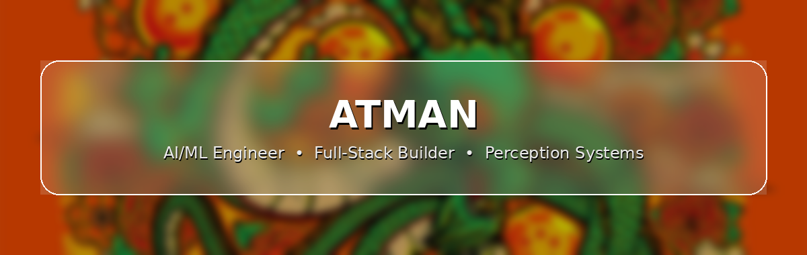

  

  

  
  

  
  
  

---

### 🚀 About Me

- 🎓 Student, self-directed builder in **Software Development & AI/ML**
- 🧠 I learn by shipping — real projects over tutorials
- 🛡️ Currently building **OmniGuard**, an agentic campus safety intelligence platform (perception → agent reasoning → human-in-the-loop decisions)
- 📐 Built **Ratioed**, a facial proportion analyzer using MediaPipe's 468-point mesh
- 🏆 Regular hackathon competitor — perception engineer, backend dev, whatever the team needs
- 📡 Roadmap in progress: NumPy → Pandas → SQL → scikit-learn → PyTorch → LangChain/RAG → Docker

---

### 🧰 Tech Stack

  

**Core:** Python · FastAPI · SQLAlchemy/SQLite · React/Vite  
**Computer Vision:** OpenCV · MediaPipe · Ultralytics YOLO26 · ByteTrack  
**Emerging:** PyTorch · LangChain/RAG · Blockchain (hash-linked ledgers) · Docker

---

### 🔥 Featured Projects

-🔐**OmniGuard** — Agentic campus safety intelligence platform. Real-time perception (YOLO26 + pose + fire/smoke detection) feeds an agentic reasoning layer, with humans making the final call. Built for a GGSIPU hackathon with a 5-person team.

-📏 **Ratioed** — Face ratio analyzer against golden-ratio proportions, MediaPipe FaceLandmarker + FastAPI.

---

### 🐍 Contribution Snake

  

---

<h3 align="center">💬 Let's Connect</h3>

  

<i>⭐ From perception pipelines to production dashboards — building things that actually ship.</i>

